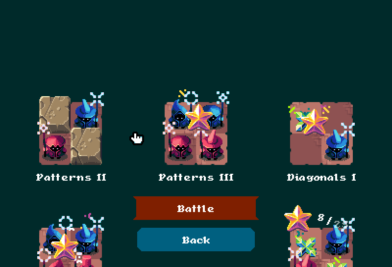
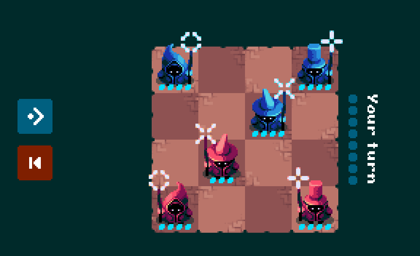
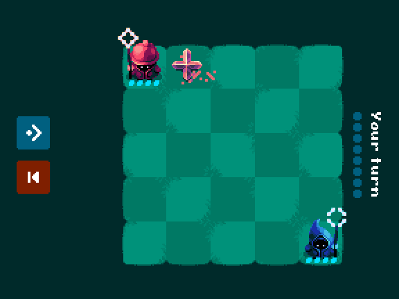
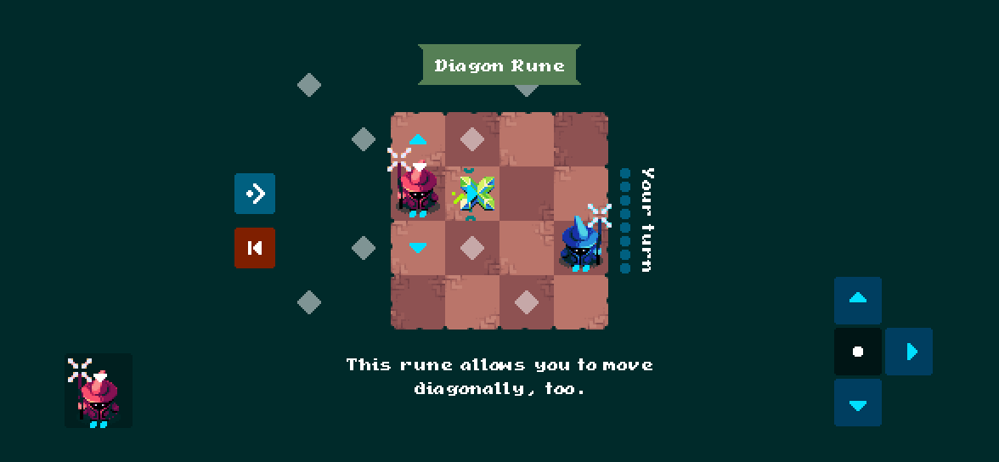

# More magic! Return to Zugzwang.

A new campaign, new battle animations, and Maginet out now on iOS and Android.

House Ruby still demands victory. The Azur Clan still objects. The battlefields, however, have changed.

## Zugzwang, redrawn.

New routes, reworked battles, and clearer lessons in spells and powerups. You'll need to earn your campaign stars again. Azur insists.

## Have at thee!

Maginettes leap into their moves. Spells fly across the board and burst on impact. The ancient quarrel is considerably less stationary.

## No hiding behind a deadlock.

Certain deadlocks now grant both sides diagonal movement. The curs can no longer shelter behind the colour of a square.

## Now on iOS and Android.

Take the feud with you: onscreen controls, move previews, and drag-and-drop. Maginet is out now on iOS and Android. Settle it on the train.

[Get it on iOS](IOS_STORE_URL_PENDING) · [Get it on Android](ANDROID_STORE_URL_PENDING)

Also: three AI difficulties, play as Azur, clearer attack previews, and more time before inactivity ends a duel.
